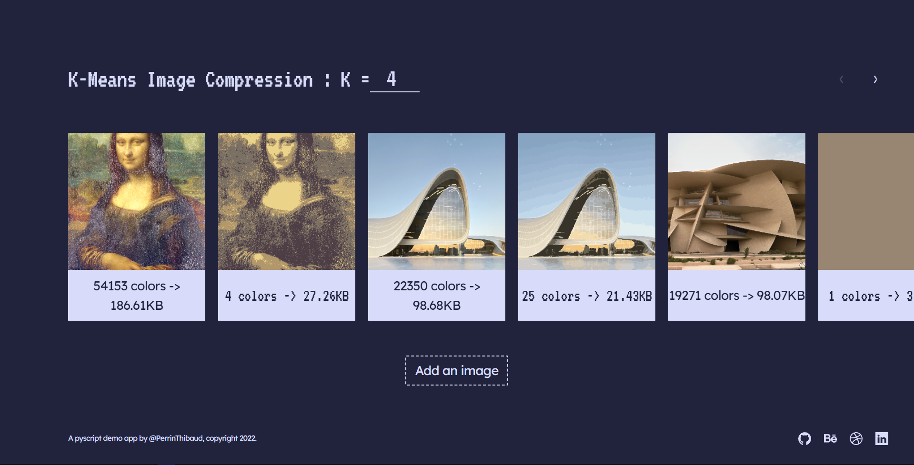

# pyscript PWA Example

This app shows how using numpy with [pyscript](https://pyscript.net).
I chose to develop by myself a K Means algorithm [notebook](https://github.com/PerrinThibaud/PyScript-Kmeans/blob/main/jupyter/Kmeans_clustering.ipynb) in order to use numpy, however pyscript supports the scikit-learn library.
For speed reasons we only run kmeans once so, sometimes it only finds one cluster, it would be better to run kmeans several times and select the one with the best results as the scikit-learn library does



[DEMO](https://perrinthibaud.github.io/PyScript-Kmeans/)

To run the app, just start it as a Flask application (keep the app running for the web API).
```bash
python3 -m venv venv
. /venv/bin/activate
pip install -r requirements.txt
flask run
```
